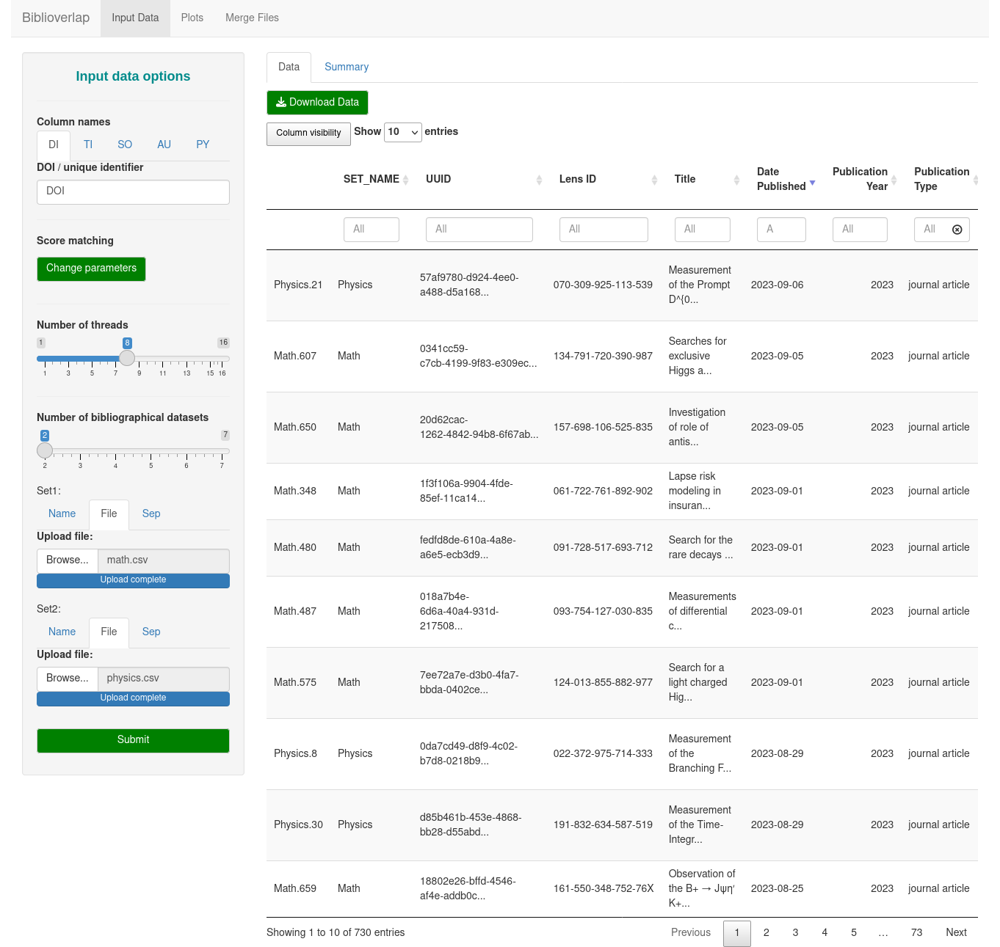

<!-- README.md is generated from README.Rmd. Please edit that file -->

```{r, include = FALSE}
knitr::opts_chunk$set(
  collapse = TRUE,
  comment = "#>",
  fig.path = "man/figures/README-",
  out.width = "100%"
)
```

# biblioverlap

<!-- badges: start -->
[](https://github.com/gavieira/biblioverlap/actions/workflows/R-CMD-check.yaml)
<!-- badges: end -->


<p align="center" width="100%">
    
</p>


Biblioverlap is a R package that implements a procedure for identification and visualization of document overlap in any number of bibliographic datasets. The datasets might be exported from the same bibliographical database or several different databases.

The package receives input data, adds an UUID (Universally Unique Identifier) to each record and performs pairwise comparisons between the datasets to identify matching documents. This identification happens through the exact match of a unique identifier (e.g. DOI) or, when the identifier is absent for the record, through a score calculated from a set of fields commonly found in bibliographic datasets (Title, Source, Authors and Publication Year).

When a match is found, the UUID of the document in the first dataset is copied to its matching counterpart in the second dataset. Thus, after all pairwise comparisons are finished, it provides the information needed to identify documents that occur in any intersections from the sets of bibliographical data provided.

## Installation

You can install the stable version of biblioverlap from [CRAN](https://cran.r-project.org/) with:

``` r
install.packages("biblioverlap")
```

It's also possible to install the development version of biblioverlap from [GitHub](https://github.com/) with:

``` r
# install.packages("devtools")
devtools::install_github("gavieira/biblioverlap")
```

## Example

This is a basic example which shows how to obtain document overlap between sets of bibliographical data using the `biblioverlap()` function:

```{r example}
library(biblioverlap) #loading package

#Input 1: Named list of bibliographic dataframes
sapply(ufrj_bio_0122, class) #ufrj_bio_0122 is an example dataset provided by the package

#Input 2: Namded list of columns for document matching 
matching_cols <- list(DI = 'DOI',
                      TI = 'Title',
                      PY = 'Publication Year',
                      AU = 'Author/s',
                      SO = 'Source Title')

#Running document-level matching procedure
biblioverlap_results <- biblioverlap(ufrj_bio_0122, matching_fields = matching_cols)

#The results of the matching returns a list containing:
#(i) a copy of the original data + UUID column (db_list)
#(ii) a summary of the matching results (summary)
sapply(biblioverlap_results, class)
```

The package also features some functions for plotting the results of `biblioverlap()`. For instance, the `plot_matching_summary()` function can be used to convert the summary of the matching procedure into a bar plot.

```{r matching_summary}
#Plotting the matching results summary
plot_matching_summary(biblioverlap_results$summary)
```

The `plot_venn()` function uses the UUID column to plot the results of the matching procedure as a Venn diagram. 

```{r venn}
#Plotting the Venn diagram
plot_venn(biblioverlap_results$db_list)
```

Similarly, the `plot_upset()` function uses the UUID column to generate a UpSet plot, which is generally better for visualizing intersections between 5 or more datasets.

```{r upset}
#Plotting the UpSet plot
plot_upset(biblioverlap_results$db_list)

```

The biblioverlap package also features a graphical user interface in the form of a ShinyApp, which can be called through the `biblioverApp()` function.

```
#loading package
library(biblioverlap)

#Using the ShinyApp
biblioverApp()
```


